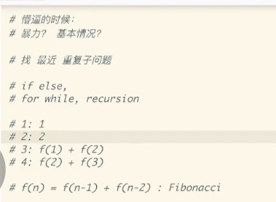

[小浩算法](https://www.geekxh.com/)

[小浩微信网页](https://mp.weixin.qq.com/s/3eJNKDTZ5y5icMnfv9Is_w)

[geekxh](https://github.com/geekxh/hello-algorithm)

[TOP 48 算法和编程面试题](https://mp.weixin.qq.com/s/eKrdrW-KaF-am7MXpNQnXA)

[labuladong的算法小炒](https://labuladong.gitbook.io/algo/)

[labuladong算法github](https://github.com/labuladong/fucking-algorithm)

[DuHouAn/Java](https://github.com/DuHouAn/Java)

[LeetCodeAnimation](https://github.com/MisterBooo/LeetCodeAnimation)

[剑指☞offer](https://github.com/todorex/Coding-Interviews)

[剑指offer视频](https://github.com/ljz756245026/jianzhi-offer-code-videos)

## 二叉堆
```
二叉堆就是一种完全二叉树，所以适合存储在数组中，而且二叉堆拥有一些特殊性质。
二叉堆的操作很简单，主要就是上浮和下沉，来维护堆的性质（堆有序），核心代码也就十行。
优先级队列是基于二叉堆实现的，主要操作是插入和删除。
**插入**是先插到最后，然后上浮到正确位置；
**删除**是调换位置后再删除，然后下沉到正确位置
```
## LRU
[LRU](https://github.com/labuladong/fucking-algorithm/blob/master/%E9%AB%98%E9%A2%91%E9%9D%A2%E8%AF%95%E7%B3%BB%E5%88%97/LRU%E7%AE%97%E6%B3%95.md)
实现原理是HashMap+双向列表的结合体，即：LinkedHashMap
- 1、如果我们每次默认从链表尾部添加元素，那么显然越靠尾部的元素就是最近使用的，越靠头部的元素就是最久未使用的。
- 2、对于某一个 key，我们可以通过哈希表快速定位到链表中的节点，从而取得对应 val。
- 3、链表显然是支持在任意位置快速插入和删除的，改改指针就行。只不过传统的链表无法按照索引快速访问某一个位置的元素，而这里借助哈希表，可以通过 key 快速映射到任意一个链表节点，然后进行插入和删除。


```
class Node {
    public int key, val;
    public Node next, prev;
    public Node(int k, int v) {
        this.key = k;
        this.val = v;
    }
}

class DoubleList {  
    // 头尾虚节点
    private Node head, tail;  
    // 链表元素数
    private int size;
    
    public DoubleList() {
        // 初始化双向链表的数据
        head = new Node(0, 0);
        tail = new Node(0, 0);
        head.next = tail;
        tail.prev = head;
        size = 0;
    }

    // 在链表尾部添加节点 x，时间 O(1)
    public void addLast(Node x) {
        x.prev = tail.prev;
        x.next = tail;
        tail.prev.next = x;
        tail.prev = x;
        size++;
    }

    // 删除链表中的 x 节点（x 一定存在）
    // 由于是双链表且给的是目标 Node 节点，时间 O(1)
    public void remove(Node x) {
        x.prev.next = x.next;
        x.next.prev = x.prev;
        size--;
    }
    
    // 删除链表中第一个节点，并返回该节点，时间 O(1)
    public Node removeFirst() {
        if (head.next == tail)
            return null;
        Node first = head.next;
        remove(first);
        return first;
    }

    // 返回链表长度，时间 O(1)
    public int size() { return size; }

}
```

## 移动零
【移动零】(https://leetcode-cn.com/problems/move-zeroes/)
```
class Solution {
    public void moveZeroes(int[] nums) {
        int j = 0;
        for (int i = 0; i < nums.length; i++) {
            if (nums[i] != 0) {
                if (i > j) {
                    nums[j] = nums[i];
                    nums[i] = 0;
                }
                j++;
            }
        }
    }
}
```

## 爬楼梯 斐波那契数列
【爬楼梯】(https://leetcode.com/problems/climbing-stairs/)

【解题思路】


```
public class Solution {
    public int climbStairs(int n) {
        if (n == 1) {
            return 1;
        }
        int first = 1;
        int second = 2;
        for (int i = 3; i <= n; i++) {
            int third = first + second;
            first = second;
            second = third;
        }
        return second;
    }
}
```
## 盛最多水的容器
【盛最多水的容器】(https://leetcode-cn.com/problems/container-with-most-water/)
```
class Solution {
    public int maxArea(int[] height) {
        int maxArea = 0;
        for(int i = 0;i<height.length - 1; i++){
            for(int j = i+1;j<height.length; j++){
                int area = (j - i) * Math.min(height[i],height[j]);
                maxArea = Math.max(area,maxArea);
            }
        }
        return maxArea;
    }
}

class Solution {
    public int maxArea(int[] height) {
        int maxArea = 0;
        for(int i = 0, j = height.length - 1;i < j;){
            int minHeight = height[i] < height[j] ? height[i++] : height[j--];
            int tempArea = (j - i + 1) * minHeight;
            maxArea = Math.max(maxArea,tempArea);
        }
        return maxArea;
    }
}
```
## 三数之和
【三数之和】(https://leetcode-cn.com/problems/3sum/)
```
//暴力
private List<List<Integer>> directlySolution(int[] nums) {
    if (nums == null || nums.length <= 2) {
        return Collections.emptyList();
    }
    Arrays.sort(nums);
    Set<List<Integer>> result = new LinkedHashSet<>();
    for (int i = 0; i < nums.length; i++) {
        for (int j = i+1; j < nums.length; j++) {
            for (int k = j+1; k < nums.length; k++) {
                if (nums[i] + nums[j] + nums[k] == 0) {
                    List<Integer> value = Arrays.asList(nums[i], nums[j], nums[k]);
                    result.add(value);
                }
            }
        }
    }

    return new ArrayList<>(result);
}
//夹逼
class Solution {
    public List<List<Integer>> threeSum(int[] nums) {
        Arrays.sort(nums);
        List<List<Integer>> res = new ArrayList<>();
        for(int k = 0; k < nums.length - 2; k++){
            if(nums[k] > 0) break;
            if(k > 0 && nums[k] == nums[k - 1]) continue;
            int i = k + 1, j = nums.length - 1;
            while(i < j){
                int sum = nums[k] + nums[i] + nums[j];
                if(sum < 0){
                    while(i < j && nums[i] == nums[++i]);
                } else if (sum > 0) {
                    while(i < j && nums[j] == nums[--j]);
                } else {
                    res.add(new ArrayList<Integer>(Arrays.asList(nums[k], nums[i], nums[j])));
                    while(i < j && nums[i] == nums[++i]);
                    while(i < j && nums[j] == nums[--j]);
                }
            }
        }
        return res;
    }
}
```
## 滑动窗口的最大值
【滑动窗口的最大值】(https://leetcode-cn.com/problems/sliding-window-maximum/)
利用双端队列，保存单调递减的数据
```
class Solution {
    public int[] maxSlidingWindow(int[] nums, int k) {
        int len = nums.length;
        if (len == 0) {
            return nums;
        }
        int[] arr = new int[len - k + 1];
        int arr_index = 0;
        //我们需要维护一个单调递增的双向队列
        Deque<Integer> deque = new LinkedList<>();
        //先将第一个窗口的值按照规则入队
        for (int i = 0; i < k; i++) {
             while (!deque.isEmpty() && deque.peekLast() < nums[i]) {
               deque.removeLast();
            }
            deque.offerLast(nums[i]);
        }
        //存到数组里，队头元素
        arr[arr_index++] = deque.peekFirst();
        //移动窗口
        for (int j = k; j < len; j++) {
            //对应咱们的红色情况，则是窗口的前一个元素等于队头元素
            if (nums[j - k] == deque.peekFirst()) {
                deque.removeFirst();
            }
            while (!deque.isEmpty() && deque.peekLast() < nums[j]) {
                deque.removeLast();
            }
            deque.offerLast(nums[j]);
            arr[arr_index++] = deque.peekFirst();
        }
        return arr;
    }
}
```
### 柱状图中最大矩形面积
【柱状图中最大矩形面积】(https://leetcode-cn.com/problems/largest-rectangle-in-histogram/)
```
public int largestRectangleArea(int[] heights) {
    int maxArea = 0;
    Stack<Integer> stack = new Stack<>();
    for (int i = 0; i < heights.length; i++) {
        while (!stack.isEmpty() && heights[stack.peek()] >= heights[i]) {
            int height = heights[stack.pop()];
            int width;
            if (stack.isEmpty()) {
                width = i;
            } else {
                width = i - stack.peek() - 1;
            }
            maxArea = Math.max(maxArea, height * width);
        }
        stack.push(i);
    }
    while (!stack.isEmpty()) {
        int height = heights[stack.pop()];
        int width;
        if (stack.isEmpty()) {
            width = heights.length;
        } else {
            width = heights.length - stack.peek() - 1;
        }
        maxArea = Math.max(maxArea, height * width);
    }
    return maxArea;
}
```
## 二叉树中序遍历
【二叉树中序遍历】(https://leetcode-cn.com/problems/binary-tree-inorder-traversal/)
```
class Solution {
	public List<Integer> inorderTraversal(TreeNode root) {
		List<Integer> res = new ArrayList<Integer>();
		dfs(res,root);
		return res;
	}
	
	void dfs(List<Integer> res, TreeNode root) {
		if(root==null) {
			return;
		}
		//按照 左-打印-右的方式遍历
		dfs(res,root.left);
		res.add(root.val);
		dfs(res,root.right);
	}
}

class Solution {
	public List<Integer> inorderTraversal(TreeNode root) {
		List<Integer> res = new ArrayList<Integer>();
		Stack<TreeNode> stack = new Stack<TreeNode>();
		while(stack.size()>0 || root!=null) {
			//不断往左子树方向走，每走一次就将当前节点保存到栈中
			//这是模拟递归的调用
			if(root!=null) {
				stack.add(root);
				root = root.left;
			//当前节点为空，说明左边走到头了，从栈中弹出节点并保存
			//然后转向右边节点，继续上面整个过程
			} else {
				TreeNode tmp = stack.pop();
				res.add(tmp.val);
				root = tmp.right;
			}
		}
		return res;
	}
}

```
## 二叉树前序遍历
【二叉树前序遍历】(https://leetcode-cn.com/problems/binary-tree-preorder-traversal/)
```
class Solution {
    public List<Integer> preorderTraversal(TreeNode root) {
        List<Integer> res = new ArrayList<Integer>();
        preorder(root, res);
        return res;
    }

    public void preorder(TreeNode root, List<Integer> res) {
        if (root == null) {
            return;
        }
        res.add(root.val);
        preorder(root.left, res);
        preorder(root.right, res);
    }
}

class Solution {
    public List<Integer> preorderTraversal(TreeNode root) {
        List<Integer> res = new ArrayList<Integer>();
        if (root == null) {
            return res;
        }

        Deque<TreeNode> stack = new LinkedList<TreeNode>();
        TreeNode node = root;
        while (!stack.isEmpty() || node != null) {
            while (node != null) {
                res.add(node.val);
                stack.push(node);
                node = node.left;
            }
            node = stack.pop();
            node = node.right;
        }
        return res;
    }
}

```

## 二叉树的层序遍历
```
//广度优先
private List<List<Integer>> levelSearchBFS(TreeNode root){
        List<List<Integer>> ret = new ArrayList<>();
        if (root == null){
            return ret;
        }
        Deque deque = new LinkedList<TreeNode>();
        deque.offer(root);
        while (!deque.isEmpty()){
            List<Integer> levalRet = new ArrayList<>();
            int levelCount = deque.size();
            for (int i = 1; i <= levelCount;i++) {
                TreeNode levelTreeNode = (TreeNode)deque.poll();
                levalRet.add(levelTreeNode.getVal());

                if (levelTreeNode.getLeft() != null) {
                    deque.offer(levelTreeNode.getLeft());
                }

                if (levelTreeNode.getRight() != null) {
                    deque.offer(levelTreeNode.getRight());
                }
            }
            ret.add(levalRet);
        }
        return ret;
    }

//深度优先
    public List<List<Integer>> levelOrder(TreeNode root) {
        if(root==null) {
            return new ArrayList<List<Integer>>();
        }
        //用来存放最终结果
        List<List<Integer>> res = new ArrayList<List<Integer>>();
        dfs(1,root,res);
        return res;
    }

    void dfs(int index,TreeNode root, List<List<Integer>> res) {
        //假设res是[ [1],[2,3] ]， index是3，就再插入一个空list放到res中
        if(res.size()<index) {
            res.add(new ArrayList<Integer>());
        }
        //将当前节点的值加入到res中，index代表当前层，假设index是3，节点值是99
        //res是[ [1],[2,3] [4] ]，加入后res就变为 [ [1],[2,3] [4,99] ]
        res.get(index-1).add(root.val);
        //递归的处理左子树，右子树，同时将层数index+1
        if(root.left!=null) {
            dfs(index+1, root.left, res);
        }
        if(root.right!=null) {
            dfs(index+1, root.right, res);
        }
    }
```

## 最小的k个数
【最小的k个数】(https://leetcode-cn.com/problems/zui-xiao-de-kge-shu-lcof/)

类似题目：【前 K 个高频元素】https://leetcode-cn.com/problems/top-k-frequent-elements/
二叉大根堆的性质是：left = i * 2 + 1,right = i * 2 +2 root = (child - 1) / 2
插入：插入到尾部，up操作
删除：删除root,用尾部替换 down操作
之所以使用大根堆是因为 根是最大的了，没有比根还大的了，所以下面都是小的，只要比根大就替换，始终保持K个最小的数据
```
class Solution {
    public int[] getLeastNumbers(int[] arr, int k) {
        int[] vec = new int[k];
        if (k == 0) { // 排除 0 的情况
            return vec;
        }
        PriorityQueue<Integer> queue = new PriorityQueue<Integer>(new Comparator<Integer>() {
            public int compare(Integer num1, Integer num2) {
                return num2 - num1;
            }
        });
        for (int i = 0; i < k; ++i) {
            queue.offer(arr[i]);
        }
        for (int i = k; i < arr.length; ++i) {
            if (queue.peek() > arr[i]) {
                queue.poll();
                queue.offer(arr[i]);
            }
        }
        for (int i = 0; i < k; ++i) {
            vec[i] = queue.poll();
        }
        return vec;
    }
}

```
## 递归模板
```
public void recur(int level, int param) {   
	// terminator   
	if (level > MAX_LEVEL) {     
	// process result     
	return;   
	}  
	// process current logic   
	process(level, param);   
	// drill down   
	recur( level: level + 1, newParam);   
	// restore 
	current status  
}
```
